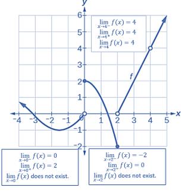
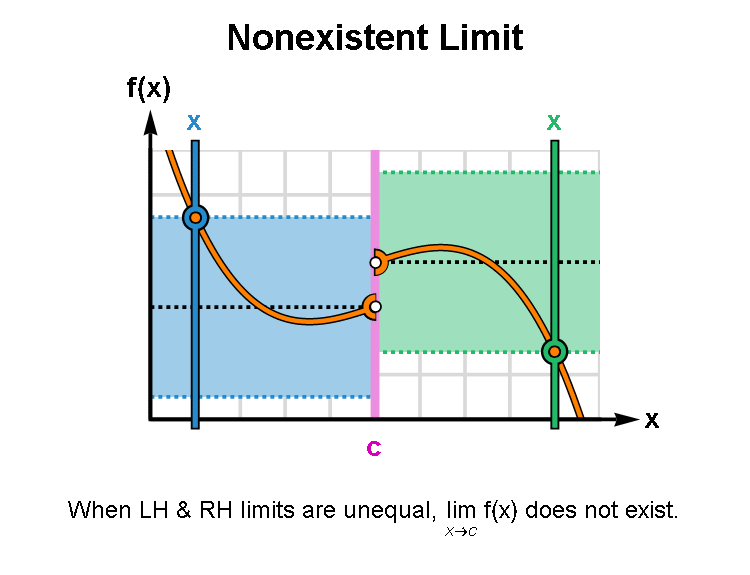

```{=html}

<style type="text/css">

/* Cascading Style Sheets (CSS) is a stylesheet language used to describe the presentation of a document written in HTML or XML. it is a simple mechanism for adding style (e.g., fonts, colors, spacing) to Web documents. */

h1.title {  /* Title - font specifications of the report title */
  font-size: 24px;
  color: DarkRed;
  text-align: center;
  font-family: "Gill Sans", sans-serif;
}
h4.author { /* Header 4 - font specifications for authors  */
  font-size: 20px;
  font-family: system-ui;
  color: DarkRed;
  text-align: center;
}
h4.date { /* Header 4 - font specifications for the date  */
  font-size: 18px;
  font-family: system-ui;
  color: DarkBlue;
  text-align: center;
}
h1 { /* Header 1 - font specifications for level 1 section title  */
    font-size: 22px;
    font-family: "Times New Roman", Times, serif;
    color: navy;
    text-align: center;
}
h2 { /* Header 2 - font specifications for level 2 section title */
    font-size: 20px;
    font-family: "Times New Roman", Times, serif;
    color: navy;
    text-align: left;
}

h3 { /* Header 3 - font specifications of level 3 section title  */
    font-size: 18px;
    font-family: "Times New Roman", Times, serif;
    color: navy;
    text-align: left;
}

h4 { /* Header 4 - font specifications of level 4 section title  */
    font-size: 18px;
    font-family: "Times New Roman", Times, serif;
    color: darkred;
    text-align: left;
}

body { background-color:white; }

.highlightme { background-color:yellow; }

p { background-color:white; }

</style>
```
```{r setup, include=FALSE}
# Detect, install and load packages if needed.
if (!require("knitr")) {
   install.packages("knitr")
   library(knitr)
}
if (!require("leaflet")) {
   install.packages("leaflet")
   library(leaflet)
}
if (!require("EnvStats")) {
   install.packages("EnvStats")
   library(EnvStats)
}
if (!require("MASS")) {
   install.packages("MASS")
   library(MASS)
}
if (!require("phytools")) {
   install.packages("phytools")
   library(phytools)
}
#
# specifications of outputs of code in code chunks
knitr::opts_chunk$set(echo = FALSE,      # include code chunk in the output file
                      warnings = FALSE,  # sometimes, you code may produce warning messages,
                                         # you can choose to include the warning messages in
                                         # the output file. 
                      messages = FALSE,  #
                      results = TRUE     # you can also decide whether to include the output
                                         # in the output file.
                      )   
```


\

\

# A Brief Review of functions

Here are the basic concepts of functions we learned previously.

## What is a function?

A **function** is a *rule* that takes an input, does something to it, and gives a unique corresponding output. If the function name is $f$, and the input name is $x$, then the unique corresponding output is called $f(x)$ (which is read as '$f$ of $x$'). Note that $f$ and $f(x)$ are different mathematical expressions:

1.  $f$ is the name of the function;

2.  $f(x)$ is the output from the function $f$ when the input is $x$.

It is often helpful to think of a function as a 'box'. You drop an input at the top, something happens to the input inside the box, and the output drops out the bottom. The box is labeled with the name of the function.

```{r echo=FALSE, fig.align ="center",  out.width = '30%'}

```

Mathematically, a function is an expression that takes input values and produces an output value based on the input value.

```{r echo=FALSE, fig.align ="center",  out.width = '15%'}

```

The key point in the definition of a function is that *for a given input value, there exists a unique output value*. **However**, there are functions in which multiple distinct input values could produce the same output value.

```{r echo=FALSE, fig.align ="center",  out.width = '65%'}

```

## Domain and Range

The **domain** of a function is the set of all input values. The range of a function is the set of all possible output values.

```{r echo=FALSE, fig.align ="center",  out.width = '55%'}

```

**Example**: Justify whether each of the following expressions defines a valid function (i.e., pass the vertical test). If it is a valid function, specify the domain and range.

1.  $f(x) = \sqrt{x} + 1/x$.

2.  $y = -x^2 + 1$.

3.  $y^2 = -x^2 + 1$.

**Sketch of Solution**: Based on the definition and vertical test, we have the following brief answers to the above questions.

1.  It is a valid function. The **domain** is $x > 0$. Note that $x = 0$ is not in the domain. The **range** is also $x>0$.

```{r echo = F, fig.align='center'}
x=seq(0.001, 25, length=1000)
y=sqrt(x) + 1/x
plot(x,y,type="l", lwd=2, ylim=c(0,5), col="brown", bty="n")
```

2.  It is also a valid function. The **domain** is all real numbers. The range

```{r echo = F, fig.align='center'}
x=seq(-1, 1, length=1000)
y= -x^2 + 1
plot(x,y,type="l", lwd=2, ylim=c(-1, 1), col="brown", bty="n")
```

3.  It is not a valid function since fails to pass the vertical line test. In fact, the expression can be rewritten into the following two different forms. $y = \sqrt{-x^2 + 1}$ (the upper semi-circle) and $y = -\sqrt{-x^2 +1}$ (the lower semi-circle). Each of the two forms is a valid function. The curve of the expression is given by

```{r echo = F, fig.align='center', fig.height=3, fig.width=3}
x=seq(-1, 1, length=1000)
y= sqrt(-x^2 + 1)
y0 = -sqrt(-x^2 + 1)
plot(x,y,type="l", lwd=2, ylim=c(-1.2,1.2), col="brown", bty="n")
lines(x,y0, lwd=2, col="brown")
```

## Piece-wise Functions

Piece-wise functions are common in practice. For example, income tax rates are dependent on the level of income. As an illustrative example, we look at the following function.

```{r echo=FALSE, fig.align ="center",  out.width = '40%'}

```

The graph of the above function is given below.

```{r echo = F, fig.align='center', fig.height=4, fig.width=4}
plot(0, xlim=c(0, 50000), ylim=c(0, 20), xlab="Income", ylab="Tax Rate (%)", bty="n")
segments(0, 0, 15000, 0, lwd=2, col="purple")
segments(15000, 12, 30000, 12, lwd=2, col="purple")
segments(30000, 18, 50000, 18, lwd=2, col="purple")
```

The **domain** of the above function is $D = [0, \infty]$ (practically, the income cannot be infinity, but mathematically, there is no way to place an upper bound of the income). The **range** of the above function has only three numbers $R = \{ 0, 12, 18\}$.

## Some Important Functions and Properties for This Course

We will only list some functions and properties that are important to this course.

### Types of Functions

The function types of functions to be used in this class throughout the semester.

1.  **Polynomial functions**: $f(x) = a_0 + a_1x + a_2x^2 + \cdots + a_nx^n$ is a n-degree polynomial function. The special cases include $F9x) = c$ (constant function), $f(x) = a_0 + a_1x$ (linear function), $f(x) = a_0 + a_1x + a_2x^2$ (quadratic function), etc.

2.  **Power functions**: $f(x) = x^a$, where $a$ is any real number (that is called the **power** of the function). The power function is a special polynomial function that has only one term and the corresponding coefficient is equal to 1. radical root functions such as $f(x) = \sqrt{x}$ is also power function since they can be expressed as $f(x) = x^{1/2}$. The reciprocal function $f(x) = 1/x$ is also a power function since it can be rewritten as $f(x) = 1/x = x^{-1/2}$.

3.  **Rational Functions**: By definition, a rational function is a ratio of two polynomial functions. $f(x) = p(x)/q(x)$ where $p(x)$ and $q(x)$ are both polynomials. **As an example**, suppose we know that the cost of making a product is dependent on the number of items, $x$, produced. This is given by $C(x) = 15000x - 0.1x^2 + 1000$ . If we want to know the average cost for producing $x$ items, we would divide the cost function by the number of items, $x$. The average cost function, which yields the average cost per item for $x$ items produced, is

    $$f(x) = \frac{C(x)}{x} = \frac{15000x - 0.1x^2 + 1000}{x}$$

4.  **Logarithmic and Exponential Functions:** For $a > 0$ and $a \ne 1$, $f(x) = \log_a(x)$ is called logarithmic function of $x$ with **base** $a$. $h(x) = a^x$ is called **exponential** function with **base** $a$. If $a = e \approx 2.71828$, the corresponding functions are called natural-based logarithmic and exponential functions.

```{r echo=FALSE, fig.align ="center",  out.width = '40%'}

```

We can easily find the domains and ranges of the two functions in the above figure. **Logarithmic function**: $D_{\text{logarithmic function}} = (0, \infty)$ and $R_{\text{logarithmic function}} = (-\infty, \infty)$. **Exponential Function**: $D_{\text{exponential function}} = (-\infty, \infty)$ and $R_{\text{exponential function}} = (0, \infty)$.

**Example**: A local restaurant estimates that weekly sales $s$ and weekly advertising costs $x$ (both in dollars) are related by $$s(x) = 14000 - 13000e^{-0.0006t}$$.

### Monotonic Functions

Based on the shape of the curves of functions, we can classify a function in one of the three categories: increasing, decreasing, or neither increasing nor decreasing.

```{r echo=FALSE, fig.align ="center",  out.width = '60%'}

```

Three business functions that we will use frequently are cost, revenue, and profit functions.

**Example**: Let $x$ be the number of items manufactured by a factory. We can define the following three frequently used functions.

1.  Cost function $C(x) = 200 + 10x +2x^2$.

2.  Revenue function $R(x) = 90 x -2x^2$.

3.  Profit function $P(x) = C(x) - R(x) = 80x - 4x^2 - 200$.

The corresponding curves of the above three functions are given in the following figure.

```{r echo=FALSE, fig.align ="center",  out.width = '60%'}

```

We can see the monotonic patterns of all three functions in the above functions.

### Composite Functions

Given functions $f:A\to B$ and $g:B\to C$, the composite function, $g\circ f$ , which is pronounced as $g$ circle $f$, is defined as $$g\circ f:A→C,(g\circ f)(x)=g(f(x))$$.

```{r echo=FALSE, fig.align ="center",  out.width = '80%'}

```

**Example**: Assume $f,g:R \to R$ are defined as $f(x)=x^2$, and \$ g(x)=3x+1\$. Find $f\circ g$ and $g\circ f$.

**Solution**: Using the definition, we have

$f\circ g (x) = f(g(x)) = [g(x)]^2= (3x + 1)^2$,

$g\circ f (x) = g(f(x)) = 3\times f(x) + 1 = 3x^2 + 1$.

In general, $f\circ g \ne g \circ f$.

### Inverse Functions

Let $f$ and $g$ be two functions such that

1.  $f\circ g(x) = f(g(x)) = x$, for every $x$ in the domain of $g$

2.  $g\circ f(x) = g(f(x)) = x$, for every $x$ in the domain of $f$,

then the function $g$ is said to be the inverse of the function $f$ and is denoted $f^{-1}$. The domain of $f$ is equal to the range of $f^{-1}$ and the range of $f$ is the domain of $f^{-1}$.

The relationship between a function $f(x)$ and its inverse $f^{-1}(x)$ is graphically characterized in the following figure.

```{r echo=FALSE, fig.align ="center",  out.width = '45%'}

```

We can see from the above figure that $f(x)$ and $f^{-1}(x)$ are symmetric with respect to $y = x$. Since both $f(x)$ and $f^{-1}(x)$ MUST pass the vertical test, therefore, the inverse of $f(x)$ exists if and only if it is strictly monotonic.

The following example demonstrates the steps for finding an inverse function.

**Example**: Find the inverse function of $f(x) = 2x^3 + 1$.

**Solution**: The detailed steps for finding the inverse function are outlined below.

```{r echo=FALSE, fig.align ="center",  out.width = '55%'}

```

# Concepts of Limits

We first introduce the concept of limit intuitively before presenting the technical steps for finding the limit of a given function at a given point.

## Definition of Limits on the number line

**Definition**: A quantity $L$ is the limit of a function $f(x)$ as $x$ approaches $a$ if, as the input values of $x$ approach $a$ (but do not equal $a$), the corresponding output values of $f(x)$ get closer to $L$. Note that the value of the limit is not affected by the output value of $f(x)$ at $a$. Both $a$ and $L$ must be real numbers. We write it as $$
\lim_{x \to a} f(x) = L.
$$

Note that $x \to a$ means *approaches* $a$. There are two different ways to approach $a$: from the left-hand and right-hand. This leads to the definition of a one-sided limit.

**Left Limit (also called Left-hand Limit)**: The of a function $f(x)$ as $x$ approaches $a$ from the **left** is equal to $L$, denoted by 
$$
\lim_{x \to a^-} f(x) = L.
$$

**Left Limit (also called Left-hand Limit)**: The of a function $f(x)$ as $x$ approaches $a$ from the **right** is equal to $L$, denoted by $$
\lim_{x \to a^+} f(x) = L.
$$

The following figure illustrates the above three definitions.

```{r echo=FALSE, fig.align ="center",  out.width = '55%'}

```

## Existence of Limit

If both left and right limits exist and are equal at $a$, the limit of the function exists at $a$ and is equal to both one-sided limits. The above figure illustrates the existence of a limit.

```{r echo=FALSE, fig.align ="center",  out.width = '55%'}

```

The next animated graph illustrates the process of obtaining the limit.

\

```{r echo=FALSE, fig.align ="center",  out.width = '65%'}
if (knitr:::is_latex_output()) {
  knitr::asis_output('\\url{https://github.com/pengdsci/MAT143/raw/main/w01/w01-LimitAtAPoint.gif}')
} else {
  
}
```


## Graphical Analysis of Limits

We can use graphs to identify the limit of a function $f(x)$ at $a$.

### Non-existence of Limits

If the left limit and right limit exist (i.e., not equal to infinity) but are not equal, the limit of the function does not exist. If both one-sided limits exist and are equal, the limit of the function exists.

```{r echo=FALSE, fig.align ="center",  out.width = '45%'}

```

\

An animated graph that shows the case of unequal onesided limits is given below.

```{r echo=FALSE, fig.align ="center",  out.width = '65%'}
if (knitr:::is_latex_output()) {
  knitr::asis_output('\\url{https://github.com/pengdsci/MAT143/raw/main/w01/w01-LeftRightLimits-Unequal.gif}')
} else {
  
}
```

\

### Infinite Limits

When one or both one-sided limits are equal to infinity (regardless of positive or negative infinity), the limit of the function does not exist.

```{r echo=FALSE, fig.align ="center",  out.width = '95%'}

```
\

The following animated graph shows the limiting process.

\

```{r echo=FALSE, fig.align ="center",  out.width = '65%'}
if (knitr:::is_latex_output()) {
  knitr::asis_output('\\url{https://github.com/pengdsci/MAT143/raw/main/w01/w01-InfiniteLimitAtAPoint.gif}')
} else {
  
}
```


### Limit When $x$ Approaches $\infty$

When $x$ goes either positive infinity or negative infinity, the resulting exists if and only if the limit is finite. Otherwise, the limit does not exist.

```{r echo=FALSE, fig.align ="center",  out.width = '55%'}

```

\

The next animated graph depicts the limiting process of the general case.
```{r echo=FALSE, fig.align ="center",  out.width = '95%'}
if (knitr:::is_latex_output()) {
  knitr::asis_output('\\url{https://github.com/pengdsci/MAT143/raw/main/w01/w01-LimitAtInfinity.gif}')
} else {
  knitr::include_graphics("img/w01-LimitAtInfinity.gif")
}
```

## Calculating Limits

We have described how to find the limit of a function at a given point graphically. Next we introduce how to find limit algebraically. The basic method is **substitution**. The following chart outlines the workflow in calculating the limit of a given function at a given value of the independent variable.

```{r echo=FALSE, fig.align ="center",  out.width = '75%'}

```


## Properties of Limits

### Sum Rule

This rule states that the limit of the sum of two functions is equal to the sum of their limits: 
$$
\lim_{x\to a}[f_1(x) + f_2(x) ] = \lim_{x\to a}f_1(x) + \lim_{x\to a}f_2(x).
$$

### Constant Function Rule

The limit of a constant function is the constant: $$\lim_{x\to a} C = C.$$

### Constant Multiple Rule

The limit of constant times a function is equal to the product of the constant and the limit of the function: $$
\lim_{x\to a}Cf(x) = k\lim_{x\to a}f(x).
$$

### Product Rule

This rule says that the limit of the product of two functions is the product of their limits (if they exist): $$
\lim_{x\to a}[f_1(x)f_2(x)] = \lim_{x\to a}f_1(x)\lim_{x\to a}f(x)
$$

### Quotient Rule

The limit of the quotient of two functions is the quotient of their limits, provided that the limit in the denominator function is not zero: 
$$
\lim_{x\to a}\frac{f(x)}{g(x)} = \frac{\lim_{x\to a}f(x)}{\lim_{x\to a}g(x)}.
$$

### Power Rule

For any real number $p$, 
$$
\lim_{x\to a}[f(x)]^p = [\lim_{x\to a}f(x)]^p.
$$ 
In particular, 


$$
\lim_{x\to a}\sqrt[p]{f(x)} = \sqrt[p]{\lim_{x\to a}f(x)}.
$$

## Algebraic Calculation of Limits by Examples

**Example 1**: Compute the value of the following limit 
$$
\lim_{x\to -2}(3x^2 + 5x -9).
$$

**Solution**: 

$$
\lim_{x\to -2}(3x^2 + 5x -9) = 3[\lim_{x\to -2} x]^2 + 5\lim_{x\to -2}x - \lim_{x\to -2}9 = 3\times (-2)^2 + 5(-2) - 9 = -7.
$$

**Example 2**: Evaluate the following limit. 

$$
\lim_{x\to 1}\frac{6-3x+10x^2}{-2x^4+7x^3+1}.
$$ 
**Solution**: Using properties of limit, we have 

$$
\lim_{x\to 1}\frac{6-3x+10x^2}{-2x^4+7x^3+1}=\frac{\lim_{x\to 1}[6-3x+10x^2]}{\lim_{x\to 1}[-2x^4+7x^3+1]}=\frac{6-3(1)+10(1)^2}{-2(1)^4+7(1)^3+1}=\frac{13}{6}.
$$

**Example 3** Find the limit 

$$
\lim_{x\to 9}\frac{4x^2}{1+\sqrt{x}}.
$$

**Solution**: Using the properties of limits (the sum rule, the power rule, and the quotient rule), we get $$
\lim_{x\to 9}\frac{4x^2}{1+\sqrt{x}}=\frac{\lim_{x\to 9}(4x^2)}{\lim_{x\to 9}(1+\sqrt{x})} = \frac{4\lim_{x\to 9}(x^2)}{(\lim_{x\to 9}1+\lim_{x\to 9}\sqrt{x})} = \frac{4\times 9^2}{(1+\sqrt{9})} = 81.
$$

**Example 4**: Suppose that $\lim_{x\to 1}f(x) = 2$ and $\lim_{x \to 1}g(x) = 3$. Calculate the limit 
$$
 \frac{g(x) - 3f(x)}{f^2(x) + g(x)}
 $$

**Solution**: Using the properties of limit, we have 
$$
\lim_{x\to 1} \frac{g(x) - 3f(x)}{f^2(x) + g(x)} =  \frac{\lim_{x\to 1}[g(x) - 3f(x)]}{\lim_{x\to 1}[f^2(x) + g(x)]} = \frac{\lim_{x\to 1}g(x) - 3\lim_{x\to 1}f(x)}{[\lim_{x\to 1}f(x)]^2 + \lim_{x\to 1}g(x)} = -\frac{3}{7}.
$$

# Average Rate of Change.

Often times we are not just interested in a function $f(x)$ itself but also in how $f(x)$ changes. To be specific, we may be interested in how much the function changed per unit, on average, over an interval.

## Average rate of change of a function over an interval

**Average rate of change of a function** $f(x)$ over an interval [$a, b$] for $a \ne b$ is defined to be $$
\frac{f(b)-f(a)}{b-a}
$$ The geometric interpretation of the average rate of change is the slope of the secant line defined based on the interval.

```{r echo=FALSE, fig.align ="center",  out.width = '45%'}
include_graphics("img/w01note16-SecantLineSlope.png")
```

**Example**: According to Google Maps, it's about 33 miles from WCU to the Independent Hall in Philadelphia. If Kevin made this trip in 45 minutes, what was his average rate of travel during the trip?

```{r echo=FALSE, fig.align ="center",  out.width = '65%'}

```

**Solution**: Let $t$ be the driving time and $f(t)$ the driving distance (that is a function of time $t$). We set $t=0$ at the starting point, i.e., $f(0)=0$. Since it takes 0.75 hours to drive to the destination, this means $f(0.75) = 33$. Now based on the definition of **the rate of change of the distance function** $f(t)$ on interval $[0, 0.75]$, we have $$
V = \frac{f(0.75) - f(0)}{0.75-0} = \frac{33-0}{0.75-0} = \frac{33}{0.75} = 44.
$$ The rate of change is 44 miles per hour.

**Example**: In 1998, Linda purchased a house for \$144,000. In 2009, the house was worth \$245,000. Find the average annual rate of change in dollars per year in the value of the house. Round your answer to the nearest dollar.

**Solution**: Since house prices ($P$) change over time ($t$), therefore, house price is a function of time $P(t)$. The objective is to find the annual rate of change of the house price. It is natural to use the year as the time variable $t$ and set $f(1998) = 144000$ and $f(2009) = 245000$. Then the annual rate of change is $$
\frac{f(2009) - f(1998)}{2009 - 1998} = \frac{245000-144000}{2009-1998} \approx 9182.
$$ 

The annual rate of change is approximately equal to \$9182.

## Difference quotient

The difference quotient of a (single variable) function is usually the name for the following expression 

$$
\frac{f(x+h)-f(x)}{h}.
$$ 


This is a variation of the formula of the rate of change 

$$
\frac{f(b)-f(a)}{b -a}
$$ 

where $a = x$ and $h = b -a$. We usually assume that $h$ is close to zero. Without loss of generality, $h$ is usually assumed to be a small positive number close to zero.

The notation of the difference quotient is easy to use to describe the derivative of a function.

**Example**: Find the difference quotient of $f(x) = x^2 + 4x -6$.

**Solution**: Using the definition of the difference of quotient, we have 
$$
\frac{f(x+h)-f(x)}{h} = \frac{[(x+h)^2 + 4(x+h) -6]-[x^2+4x-6]}{h}=\frac{2hx+h^2+4h}{h}=2x+h+4.
$$

**Example**: Find the difference quotient of $f(x) = \sqrt{x}$.

**Solution**: Using the formula of the difference quotient, we have 
$$
\frac{\sqrt{x+h}-\sqrt{x}}{h} = \frac{(\sqrt{x+h}-\sqrt{x})(\sqrt{x+h}+\sqrt{x})}{h(\sqrt{x+h}-\sqrt{x})} = \frac{(x+h)-x}{{h(\sqrt{x+h}+\sqrt{x})}} = \frac{1}{\sqrt{x+h}+\sqrt{x}}.
$$

**Example**: Let $D$ be on the elasticity of demand that is generally defined in the following 
$$
D = \frac{tC}{P + t}
$$

where $P,t, C$ are respectively price, tax, and constant. We are interested in the effect of the tax change on demand by looking at the difference quotient.

**Solution**: By the definition of **difference quotient**, we have 
$$
\frac{D(t+h) - D(t)}{h} = \frac{\frac{(t+h)C}{P+(t+h)}-\frac{tC}{P+t}}{h} = \frac{(t+h)C}{h(P+t+h)}-\frac{tC}{h(P+t)}
$$

# Exercises

1.  A bakery has the following pricing for large orders of cupcakes. The first 100 cupcakes of any order cost \$2.00 each. Each of the next 150 cupcakes only cost \$1.75. And each cupcake ordered in excess of 250 costs \$1.25. Write the expression of the function and specify the domain and the range of the function respectively.

2.  A rental home on Airbnb rents for \$100 a night for the first three nights, \$90 a night for the next three nights, and \$80 a night for each remaining night. The total cost $T$ is a function of the number of nights $x$ that a guest stays. Write the piece-wise 

